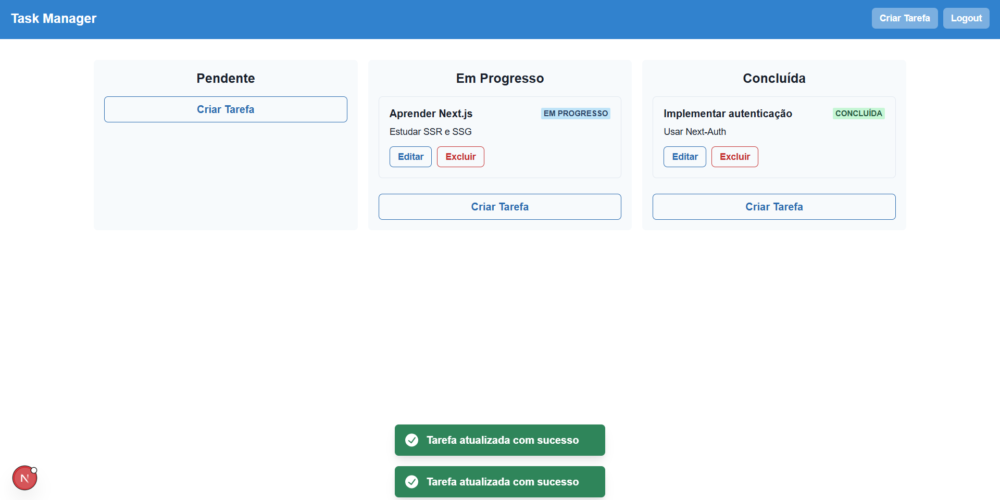

# Task Manager

Um gerenciador de tarefas simples com visualização em Kanban, autenticação de usuário e suporte a drag and drop entre colunas. Desenvolvido com Next.js, React, Chakra UI e NextAuth.



## Funcionalidades

- **Autenticação de Usuário** (NextAuth)
- **Visualização Kanban**: Tarefas organizadas em colunas (Pendente, Em Progresso, Concluída)
- **Criação, edição e exclusão de tarefas**
- **Drag and Drop**: Arraste tarefas entre colunas para mudar o status
- **Modal para criar/editar tarefas**
- **Feedback visual com Chakra UI**

## Tecnologias Utilizadas

- [Next.js](https://nextjs.org/)
- [React](https://react.dev/)
- [Chakra UI](https://chakra-ui.com/)
- [NextAuth.js](https://next-auth.js.org/)

## Instalação

1. **Clone o repositório:**
   ```bash
   git clone https://github.com/seu-usuario/taskmanager.git
   cd taskmanager
   ```

2. **Instale as dependências:**
   ```bash
   npm install
   # ou
   yarn install
   ```

3. **Configuração do NextAuth:**
   - Crie um arquivo `.env.local` na raiz do projeto e adicione as variáveis necessárias para o NextAuth (exemplo de configuração com provider de email/senha ou GitHub).

4. **Inicie o servidor de desenvolvimento:**
   ```bash
   npm run dev
   # ou
   yarn dev
   ```

5. **Acesse:**
   ```
   http://localhost:3000
   ```

## Como Usar

1. **Login:**  
   Faça login para acessar o dashboard.

2. **Criar Tarefa:**  
   Clique em "Criar Tarefa" em qualquer coluna para adicionar uma nova tarefa.

3. **Editar/Excluir:**  
   Use os botões "Editar" e "Excluir" em cada card de tarefa.

4. **Mover Tarefas:**  
   Arraste e solte tarefas entre as colunas para mudar o status.

## Observações

- O backend de tarefas é um mock em memória (não persistente).
- Para produção, adapte a API para usar um banco de dados real e configure o NextAuth com provedores seguros.

## Licença

MIT
